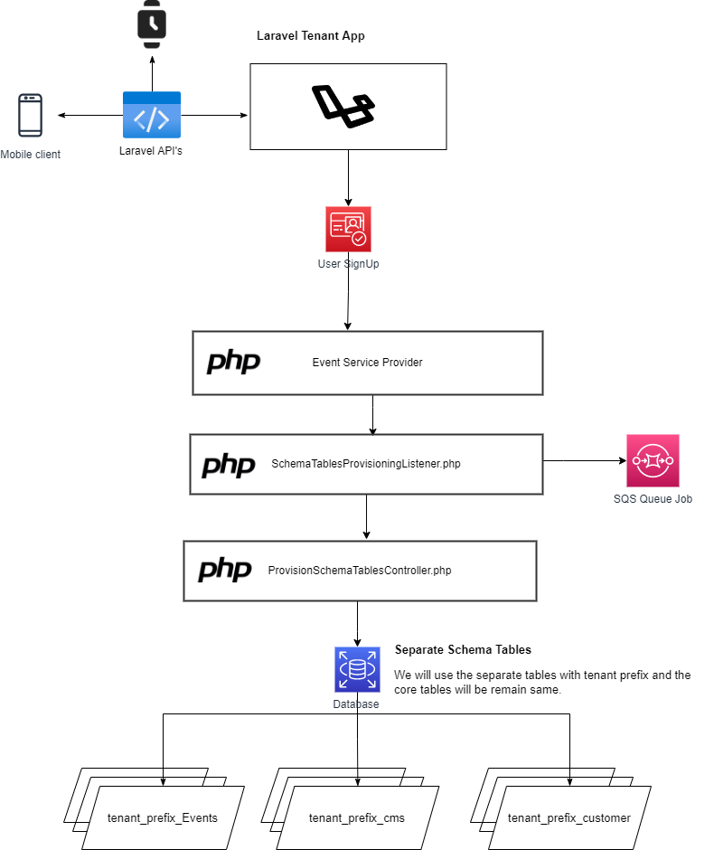
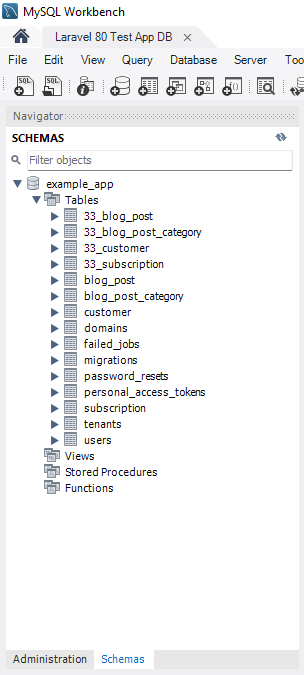

 

## Project Setup Guide

- Clone the repository 
- install composer file
- Set Directory (Storage and Bootstrap) permission 7775
- cp en-example to .env
- Run npm install
- genrate application key -> php artisan key:generate
- Run the following command to make the application live './vendor/bin/sail up -d'

### SaaS Application

- Separate Schema table for tenancy within the same database
  

## Security Vulnerabilities

If you discover a security vulnerability within Laravel, please send an e-mail to Taylor Otwell via [taylor@laravel.com](mailto:taylor@laravel.com). All security vulnerabilities will be promptly addressed.

## License

The Laravel framework is open-sourced software licensed under the [MIT license](https://opensource.org/licenses/MIT).
